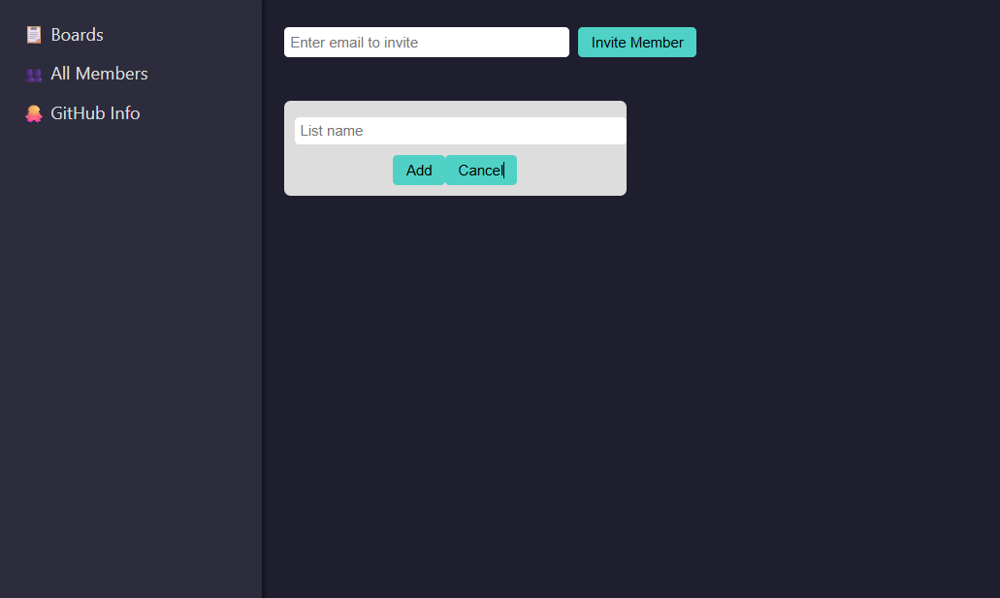
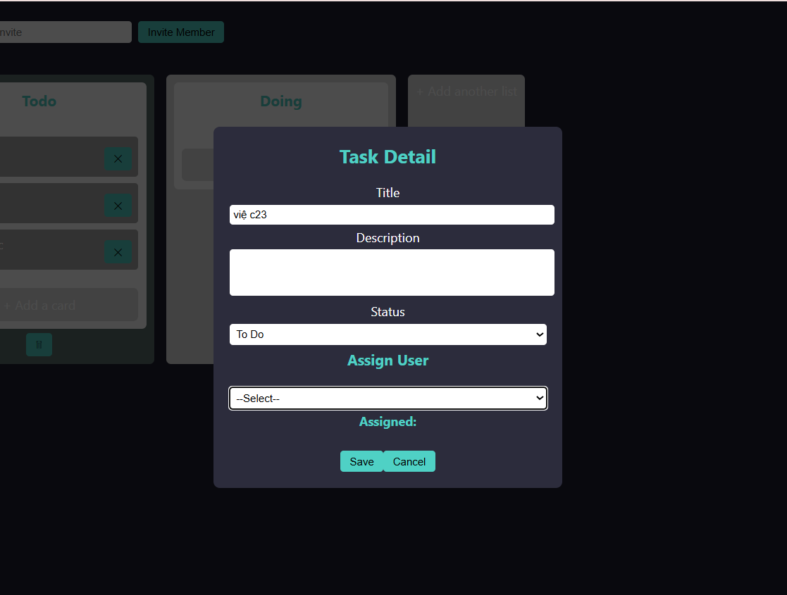
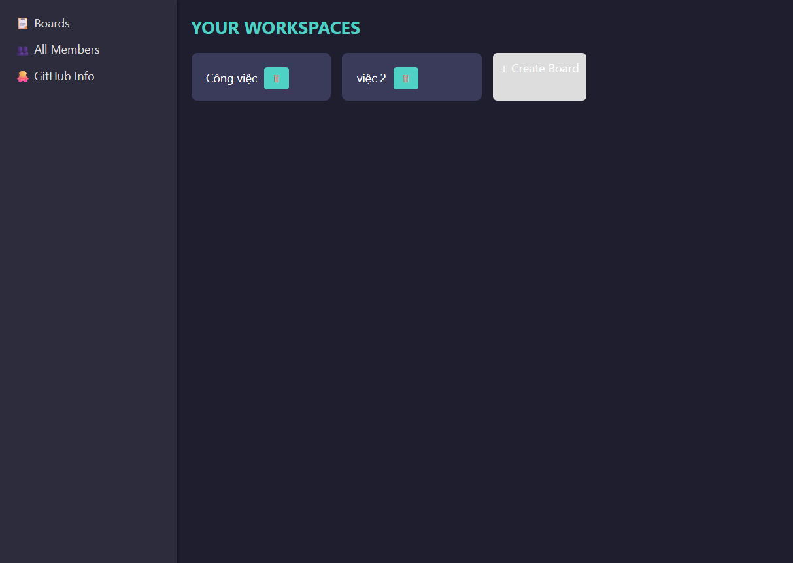
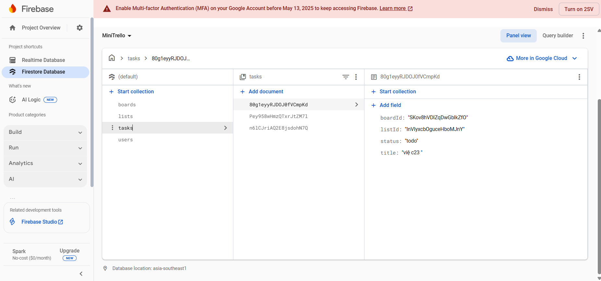
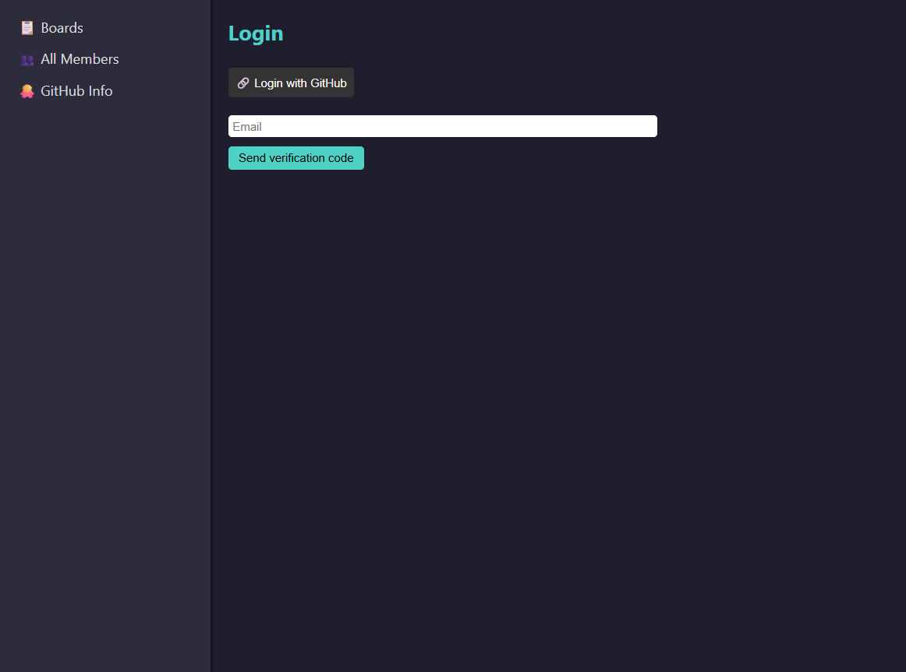
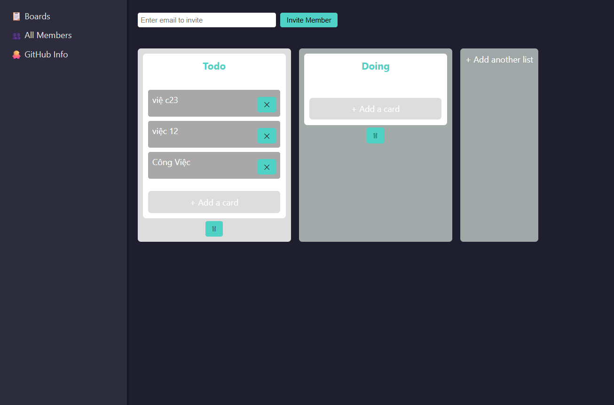
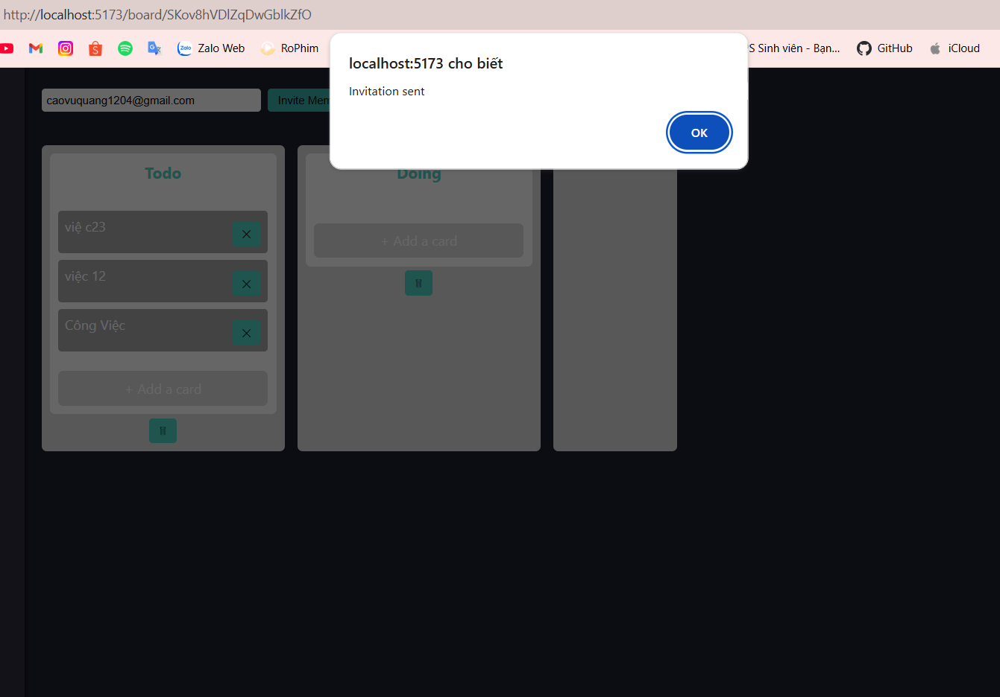

********* Cấu Trúc thư mục:
```text
        backend/
        ├── index.js
        ├── serviceAccountKey.json
        ├── package.json
        ├── routes/
        │ ├── assignments.js
        │ ├── boards.js
        │ ├── members.js
        │ ├── users.js
        │ ├── github.js
        │ ├── invites.js
        │ ├── cards.js
        │ └── task.js
        src/
        ├── App.jsx
        ├── index.css
        ├── main.jsx
        ├── context/
        │ └── AuthContext.jsx
        ├── components/
        │ ├── Sidebar.jsx
        │ ├── BoardList.jsx
        │ ├── BoardDetail.jsx
        │ ├── TaskList.jsx
        │ ├── TaskDetail.jsx
        │ ├── UserList.jsx
        │ ├── MemberList.jsx
        │ ├── GithubInfo.jsx
        │ ├── AuthForm.jsx
        │ └── Profile.jsx
        ├── utils/
        │ ├── api.js
        │ ├── firebase.js
        │ └── users.js
        assets/
        screenshots/
        package.json
        vite.config.js
```

********* Cách cài đặt & chạy dự án
```text
        1. Clone repo về
            git clone https://github.com/CaoVuQuang/MiniTrello.git

        2. Cài đặt dependencies
            Frontend:
                cd MiniTrello
                npm install
            Backend:
                cd backend
                npm install

        3. Thiết lập biến môi trường
            Tạo file .env ở cả frontend & backend nếu cần.
            Ví dụ backend .env:
                PORT=3000
                JWT_SECRET=your_jwt_secret
                FIREBASE_API_KEY=...
                FIREBASE_PROJECT_ID=...
                EMAIL_USER=your_email@gmail.com
                EMAIL_PASS=your_email_password
                GITHUB_CLIENT_ID=...
                GITHUB_CLIENT_SECRET=...
            Frontend .env:
                REACT_APP_API_URL=http://localhost:5173
                REACT_APP_FIREBASE_API_KEY=...
                REACT_APP_FIREBASE_PROJECT_ID=...
                (Thay bằng giá trị của bạn từ Firebase + GitHub)

        4. Chạy dự án
            Frontend:
                npm run dev
                Mặc định frontend chạy ở http://localhost:5173

            Backend:
                cd backend
                node index.js
                Mặc định backend chạy ở http://localhost:3000

        5. Kiểm tra
        Mở trình duyệt → Thử đăng ký, đăng nhập, tạo board/card/task…
```

********* Các công nghệ sử dụng
```text
        Frontend
            React.js — Framework để xây dựng giao diện người dùng (UI)
            React Router — Quản lý định tuyến (routing) giữa các trang
            Socket.IO (client) — Để nhận realtime updates từ server
            React DnD — Kéo-thả task giữa các cột
            Axios / Fetch API — Gọi API từ backend

        Backend
            Node.js — Nền tảng chạy JavaScript ở server
            Express.js — Framework web để tạo API REST
            Socket.IO (server) — Gửi thông báo & cập nhật realtime tới tất cả client
            Nodemailer — Gửi email xác thực cho người dùng
            jsonwebtoken (JWT) — Quản lý phiên đăng nhập, xác thực token
            Firebase Admin SDK — Truy cập & thao tác cơ sở dữ liệu Firebase từ server
            GitHub OAuth API — Tích hợp đăng nhập và thông tin GitHub

        Database
            Firebase Firestore / Realtime Database — Lưu trữ dữ liệu của ứng dụng (người dùng, board, card, task, …)

        Công cụ & tiện ích
            Git + GitHub — Quản lý mã nguồn & nộp bài
            Visual Studio Code — Trình soạn thảo mã
            Postman / Thunder Client — Test các API
            tree / PowerShell — Xuất cấu trúc thư mục dự án
```
********* Hình ảnh ứng dụng thực tế
        Thêm lis
            
        Task Detail
            
        Hiển Thị Board
            
        Firebase
            
        Login
            
        Hiển thị List
            
        Invite
            # MiniTrello
# MiniTrello
# MiniTrello
# MiniTrello
# MiniTrello
